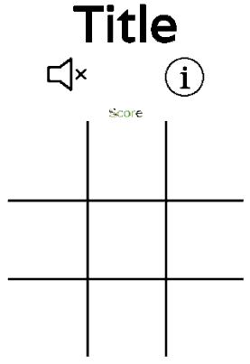
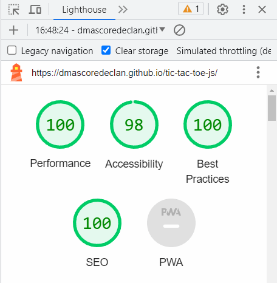
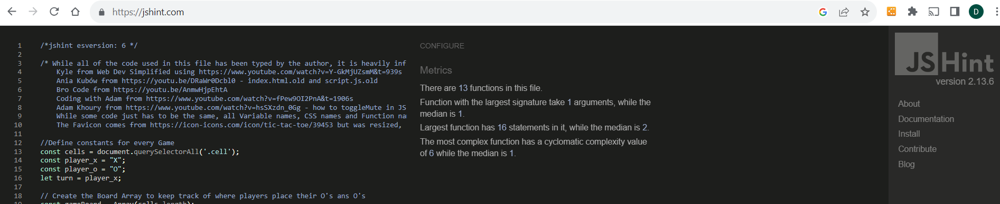

# Table of contents

- [Tic Tac Toe](#tic-tac-toe)
  - [Site Owner Goals](#site-owner-goals)
  - [Design](#design)
  - [Features](#features)
  - [Testing](#testing)
  - [Deployment](#deployment)
  - [Technologies Used](#technologies-used)
  - [Deployment](#deployment)
  - [Credits](#credits)
  - [Acknowledgments](#acknowledgments)

# Tic Tac Toe

This game is a fun game for two players to compete against each other.  Player X competes against Player O to get three marks in a row in a 3 x 3 grid.

The application loads with the Instruction being overlayed on a gameBoard.  Once you close the Instructions, an empty gameBoard is presented with 9 cells in a 3 x 3 grid.  

On initial load, the sound is muted and has an unmute button to toggle the sound On/Off.  The sounds are played when a user places an X or an O in a cell on the gameBoard and when the game is over.  

 The cursor becomes a pointer when placed over the Mute/Unmute, Instructions, Restart buttons and the cells in the grid.  
 
 X always goes first.  When X places their mark, the turn is switched to O.

## Site Owner Goals
- To provide the user with an easy to navigate game that is fun to play against an opponent.
- To present the user with a website that is visually appealing and fully responsive.
- To present the user with a website that is intuitive and does not need any instructions, despite them being provided.  

###	First Time User
- As a first time user I want to be able to easily understand the purpose of the game.
- As a first time user I want to be able to intuitively navigate the game, play the game, see my score and restart the game once it ends.
- As a first time user I want to be able to access the instructions of the game.

### Returning user
- As a returning user I want to have fun.
- As a returning user I want to beat my opponent.
- As a returning user I want to beat the computer.

## Design
Its designed to be intuitive to figure out, using commonplace icons which give clear purpose messages when hovered over. 

### Colours
The colour scheme of the website are black, white and green with lighter shades of green used for the hover effect.  
[WebAIM Contrast Checker Result 1](https://webaim.org/resources/contrastchecker/?fcolor=000000&bcolor=FBFAF8)  
[WebAIM Contrast Checker Result 2](https://webaim.org/resources/contrastchecker/?fcolor=79A749&bcolor=000000)

Great care was taken to establish a good contrast between background colours and text at all times to ensure maximum user accessibility. 

### Fonts
There are two fonts used in the site: "Varela", backed up by sans-serif and "Permanent Marker" backed up by cursive.

"Varela" is used throughout while "Permanent Marker" font is the main font used for the mark of X and O.  These fonts were imported via [Google Fonts](https://fonts.google.com/specimen/Permanent+Marker?query=permanent). 

### Imagery
There is no imagery in the application other than icons and hover effects.  The app was designed so that nothing can happen unless you participate within the realms of the actionable areas of the site.  Within the page boundaries, visual clues are given on what you can/should do, or a popup appears with concise instructions on your next possible options.  

### Wireframe
The wireframe was produced using Paint.net. The wireframe for the Mobile and Desktop are the same, as the game was designed for a Mobile device.

 

 
Wireframe

 

### Layout
This site is a single page site with 5 sections:
- an Instruction overlay
- control buttons to control the Sound, number of Players and Instructions
- a Score area
- a Game area
- a Results and Restart area

## Features
The landing page is an overlay with an opacity of .9 that covers the entire viewport.  It explains what each icon does and the rules of Tic Tac Toe.  Once the X icon to close the page is clicked, the game is revealed.  

The site has a very simple layout which includes a h1 heading stating the name of the game.  Below the h1, three large icons/buttons are displayed.  Hovering over the icons indicates their function. 

The first icon toggles between mute and unmute, the site defaults to mute. 

The second icon toggles between playing the computer or playing another player, the site defaults playing against another player.  Toggling players, resets the game board, but not the score.

The third icon redisplays the overlay with the instructions.

Below the icons, the scoreArea is displayed, these scores are updated by javascript (JS).  The Score Area shows the number of Draws/X wins/O Wins for this session, regardless of whether you play an opponent or the computer.

Then the gameBoard is displayed in a 3x3 grid, this is where the Xs and Os are displayed.  

In order to indicate whose turn it is, the user is presented with an X or an O when they hover over an empty cell.  If the cell is occupied, the hover is deactivated.  When the application is loaded, it initialises with X being the first player and thus, an X hovers over all 9 cells until X places their mark. 

On touch screen devices, (devices without a pointer), the X/O hover works by pressing and holding the cell you'd like to select, but the mark is not placed unless you press a cell briefly.  

Everytime a mark is placed in a cell, a click sound is made when the game is unmuted.

Everytime a mark is placed, JS determines if this has resulted in a Win or Draw, if it does, a gameOverSound is played, a div with the result is displayed, identifying X or O as the winner and the scoreArea is updated to increment the DRAW/X wins/O wins.  The Restart button is presented in this div, to run the JS code to reset the gameBoard and hover effects.  If cells remain unoccupied and a winner has not been determined, the game continues. 

The site works best in portrait.  Media queries are used to prevent the viewport rotating if the size of the screen is less than 320px x 767px, the exact size of the game area. 

## Testing

### Validator Testing
#### HTML 

No errors were returned when passing through the official W3C Markup Validator [W3C Validator Results](https://validator.w3.org/nu/?showsource=yes&doc=https%3A%2F%2Fdmascoredeclan.github.io%2Ftic-tac-toe-js%2F)
        
#### CSS

No errors were returned when passing through the official W3C CSS Validator [W3C CSS Validator Results](https://jigsaw.w3.org/css-validator/validator?uri=https%3A%2F%2Fdmascoredeclan.github.io%2Ftic-tac-toe-js%2F&profile=css3svg&usermedium=all&warning=1&vextwarning=&lang=en)
#### Accessibility

The site achieved a Lighthouse accessibility score of 98% indicating that the colours and fonts chosen are easy to read and accessible.  
    

    
Lighthouse Result

    
    

#### Jshint

There is 1 warning: "Expected an assignment or function call and instead saw an expression." - the code works and produces no Warnings or Errors in the DOM Console.
    

    
Jshint

    
    

### Links Testing
- The navigation link was tested manually to ensure the user is directed to the correct external wikipedia site.
 
### Browser Testing
- The Website was tested on Google Chrome, Firefox, Microsoft Edge, Safari browsers with no issues noted.
    
### Device Testing
- The website was viewed on a variety of devices such as Desktop, Laptop, iPhone 8, iPhone 11, iPad, and Androids to ensure responsiveness on various screen sizes. The website performed as intended. The responsive design was also checked using Chrome developer tools across multiple devices with structural integrity holding for the various sizes.
- I also used the following websites to test responsiveness:
    - [Responsinator](http://www.responsinator.com/?url=https%3A%2F%2Fdmascoredeclan.github.io%2Ftic-tac-toe-js%2F)
    - [Am I Responsive](http://ami.responsivedesign.is/?url=https%3A%2F%2Fdmascoredeclan.github.io%2Ftic-tac-toe-js%2F)

### Friends and Family User Testing
Friends and family members were asked to review the site and documentation to point out any bugs and/or user experience issues. They tested on a variety of iPhones and Android devices.  On devices with no mouse, the :hover::after css works but only if you know that you need to touch the screen for a milisecond longer than normal!
On one users android device, the sound works for the first mark being placed and then doesn't work for the remaining moves.  The bug could not be replicated.

### Fixed Bugs

#### Mute/Unmute image did not appear in the browser, despite the button element showing up

I was using the incorrect path and it took a long to figure out but was fixed by changing the path to the images file by including "../" in the path.

#### The Score Area did not work and produced console errors.  On github.io the game never revealed the score, the game never concluded despite being OVER!

This took a really long time to figure out because the error was caused by the deployment being out of sync with the code.  Git showed that the code I used had been commited to Git, but when I inspected the code in the browser, the code was a previous version of the code.  I rebuilt the deployment and the code updated in the browser and worked as expected.

#### Toggling between One Player and Two Player broke the game in that after the first game, the cells could not be clicked

It took >10 hours to figure out that the previously applied eventListeners to handleClickComputer and handleClickPlayerVsPlayer had to be removed before the altenative handleClick was applied.

### Known Bugs

- Touch screen devices make the entire gameBoard div, shimmer before displaying the hover effects.
- The game just doesn't appear well on small mobile devices in landscape mode.  Adjusting the size makes it almost impossible to play
- The media queries are not refined enough to keep the game in portrait mode if the user rotates their device to landscape.  The rules work on [emulators](http://www.responsinator.com/?url=https%3A%2F%2Fdmascoredeclan.github.io%2Ftic-tac-toe-js%2F) but not on all of the physical devices I've tested on.

### Features Left to Implement
- Include inputs at the outset to indicate the name of Player 1 (X) and Player 2 (O).
- Allow users to login and create a profile so that their scores could be recorded on a persistent leaderboard.  
- Save player score to the leaderboard.  
- A two player game where both players are at different devices of the same game.

#### The game does not look well on small devices when in landscape:

[Stackoverflow fix](https://stackoverflow.com/questions/63374529/disable-landscape-view-for-a-responsive-design-website) - this didn't work!

## Deployment
The live link can be found here - [tic-tac-toe-js](https://dmascoredeclan.github.io/tic-tac-toe-js/)

 

 
Am I Responsive Images

 

## Technologies Used

### Languages
- HTML5
- CSS
- JS (ES6)

### Frameworks - Libraries - Programs Used
- [Am I Responsive](http://ami.responsivedesign.is/) - Used to verify responsiveness of website on different devices.
- [Responsinator](http://www.responsinator.com/) - Used to verify responsiveness of website on different devices.
- [Chrome Dev Tools](https://developer.chrome.com/docs/devtools/) - Used for overall development and tweaking, including testing responsiveness and performance.
- [GitHub](https://github.com/) - Used for version control and hosting.
- [MyGitHub](https://github.com/DMASCoreDeclan/tic-tac-toe-js) - Used for version control and hosting of this project.
- [Google Fonts](https://fonts.google.com/) - Used to import and alter fonts on the page.
- [W3C](https://validator.w3.org/) - Used for HTML & CSS Validation.

## Deployment

The project was deployed using GitHub pages. The steps to deploy using GitHub pages are:
1. Go to the repository on GitHub.com
2. Select 'Settings' near the top of the page.
3. Select 'Pages' from the menu bar on the left of the page.
4. Under 'Source' select the 'Branch' dropdown menu and select the main branch.
5. Once selected, click the 'Save'.
6. Deployment should be confirmed by a message on a green background saying "Your site is published at" followed by the web address.

The live link can be found here - [Tic Tac Toe](https://dmascoredeclan.github.io/tic-tac-toe-js/)

## Credits

### Media

[TicTacToe Favicon](assets/images/tic-tac-toe-white-100px.png)
 
- (https://icon-icons.com/icon/tic-tac-toe/39453)

[Iconfinder](https://www.iconfinder.com/) - Mute/Unmute pngs which were recolored, renamed, restyled

- (https://www.iconfinder.com/icons/4593140/audio_max_sound_speaker_volume_icon)

- (https://www.iconfinder.com/icons/4593142/audio_mute_sound_speaker_volume_icon)

[Flaticon](https://www.flaticon.com/free-icons/vs) - One/Two player icons
 
- https://www.flaticon.com/search?word=player%20versus%20computer
 
- https://www.flaticon.com/search?word=player%20versus%20player

### Resources Used

 - While all of the code used in this file has been typed by the author, the final design is a hybrid of designs from the following developers:
 - [Kyle from Web Dev Simplified](https://www.youtube.com/watch?v=Y-GkMjUZsmM&t=939s) - index.html.old and script.js.old
 - [Ania Kubów](https://youtu.be/DRaWr0Dcbl0) - index.html.old and script.js.old
 - [Bro Code](https://youtu.be/AnmwHjpEhtA)
 - [Coding with Adam](https://www.youtube.com/watch?v=fPew9OI2PnA&t=1906s)
 - [Adam Khoury](https://www.youtube.com/watch?v=hsSXzdn_0Gg) - toggleMute in JS
 - [CSS-Tricks](https://css-tricks.com/snippets/css/orientation-lock/) - to prevent the screen rotating from portrait to landscape
 - [Flaticon](https://www.flaticon.com/free-icons/vs)
 

 - While some code just has to be the same, all Variable names, CSS names and Function names have been changed.  The design is fundamentally the same as Coding with Adam, with additional feature such as the Mute/Unmute Audio button.  The .wav sounds are downloaded from CodingWithAdmam channel, but were renamed before upload and are called by different names in JS.
    

## Acknowledgments
A huge THANKS to Jamie_cohort_lead_5p - my colleague on the course :)

My mentor Antonio for his support and advice.

The Code Institute slack community for their quick responses and very helpful feedback!