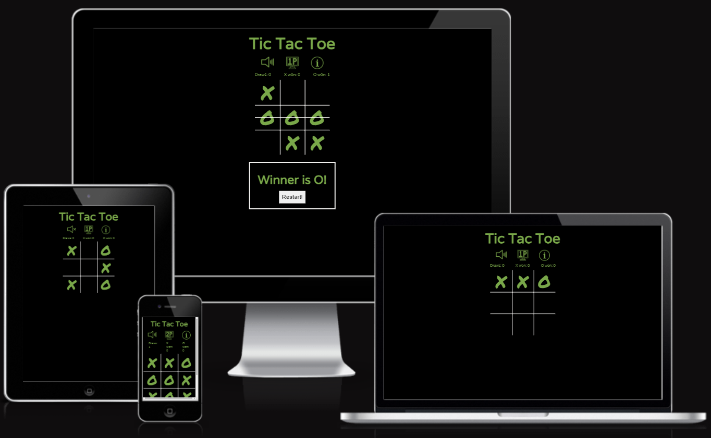

# Tic Tac Toe

This application is a simple game of Tic Tac Toe.  The application loads with the sound muted and has an unmute button to toggle the sound On/Off.  The sounds are played when a user places an X or an O in a cell on the gameBoard and when the game is over.  The sound is muted on initial load.

An empty gameBoard is presented with 9 cells in a 3 x 3 grid.  The cursor becomes a pointer when placed over the Mute/Unmute button, the cells in the grid and the restart button when it is presented.  X always goes first.  When X places his mark, the turn is switched to O.

In order to indicate whose turn it is, the user is presented with an X or an O when they hover over an empty cell.  If the cell is occupied, the hover is deactivated.  When the application is loaded, it initialises with X being the first player and thus, an X hovers over all 9 cells until X places their mark. 

On touch screen devices, (devices without a pointer), the X/O hover works by pressing and holding the cell you'd like to select, but the mark is not placed unles you press a cell briefly.  

The live link can be found here - [tic-tac-toe-js](https://dmascoredeclan.github.io/tic-tac-toe-js/)

 

 
Am I Responsive Images

 

## Site Owner Goals 
- To provide the user with information about the benefits of yoga, with a particular focus on mental wellbeing. 
- To provide the user with clear and concise instructions as to how to complete each pose along with a demonstrative image and a description of the emotional benefits.
- To present the user with a website that is easy to navigate, fully responsive and invokes a sense of calm through the use of appropriate colours and imagery. 
- To enable the user to locate yoga studios in their local area if they wish to continue their practice.
- To allow users to contribute their suggested yoga poses and sign up to the Mind Yoga Newsletter. 

## User Stories
- ### First time user / Returning User / Frequent User
  - The application is simple, its a game of Tic Tac Toe between two players.  It never progresses betond that.  

## Design
Its designed to be intuitive to figure out, thereby no insctructions are given.  The only barrier to playing the game is, if you don't know how to play TicTacToe!

### Imagery
There is no imagery in the application other than icons and hover effects.  The app was designed so that nothing can happen unless you participate withing the realms of the app.  Within the page boundaries, visual clues are given on what you can/should do or a popup appears with concise instructions on your next possible options.  

### Colours
The colour scheme of the website are black, white and green with varying shades of green used for the hover effect.  
[WebAIM Contrast Checker Result 1](https://webaim.org/resources/contrastchecker/?fcolor=000000&bcolor=FBFAF8)  
[WebAIM Contrast Checker Result 2](https://webaim.org/resources/contrastchecker/?fcolor=79A749&bcolor=000000)

### Fonts
The "Permanent Marker" font is the main font used for the mark of X or O.  This font was imported via [Google Fonts](https://fonts.google.com/). I'm used Cursive as a backup font, in case for any reason the main font isn't being imported into the site correctly.

## Wireframes
Wireframes were produced using Balsamiq. 

 

 
Desktop Wireframe

 

 

    
Mobile Wireframe

 

## Features
- This is a single page application of Tic Tac Toe.  X always goes first.  The application loads with the sound muted and has an unmute button to toggle the sound On/Off.  The sounds are played when a user places an X or an O in a cell on the gameBoard and when the game is over.  The sound is muted on initial load.

An empty gameBoard is presented with 9 cells in a 3 x 3 grid.  The cursor becomes a pointer when placed over the Mute/Unmute button, the cells in the grid and the restart button when it is presented.  X always goes first.  When X places his mark, the turn is switched to O.

In order to indicate whose turn it is, the user is presented with an X or an O when they hover over an empty cell.  If the cell is occupied, the hover is deactivated.  When the application is loaded, it initialises with X being the first player and thus, an X hovers over all 9 cells until X places their mark. 

On touch screen devices, (devices without a pointer), the X/O hover works by pressing and holding the cell you'd like to select, but the mark is not placed unles you press a cell briefly.  

### Features Left to Implement
- Perhaps a link to  when you click on the h1.
- In addition to the hover effect indicating who the current player is, perhaps some text also appearing.
- Include inputs at the outset to indicate the name of Player 1 (X) and Player 2 (O).
- Make it a one player game, playing against the computer.

## Testing

### Validator Testing
- #### HTML
    - No errors were returned when passing through the official W3C Markup Validator
        - [W3C Validator Results](https://validator.w3.org/nu/?showsource=yes&showoutline=yes&showimagereport=yes&doc=https%3A%2F%2Fdmascoredeclan.github.io%2Ftic-tac-toe-js%2F)
    - One Empty Heading Warning initially appeared.  I inserted a period that would be replaced by javascript innerText once the game has ended.  The period will be replaced by javascript generated resultText.
- #### CSS
    - No errors were found when passing through the official W3C CSS Validator 
        - [W3C CSS Validator Results](https://jigsaw.w3.org/css-validator/validator?uri=https%3A%2F%2Fdmascoredeclan.github.io%2Ftic-tac-toe-js%2F&profile=css3svg&usermedium=all&warning=1&vextwarning=&lang=en)
- #### Accessibility 
    - The site achieved a Lighthouse accessibility score of 100% which confirms that the colours and fonts chosen are easy to read and accessible 

    

    
Lighthouse Result

    
    

- #### Jshint 
    

    
Jshint Result

    
    

 
### Links Testing
- All navigation links were tested manually to ensure the user is directed to the correct section of the website.
- Social Media links in the footer of each page were tested manually to ensure they direct the user to the correct page and open in a new tab. 

### Browser Testing
- The Website was tested on Google Chrome, Firefox, Microsoft Edge, Safari browsers with no issues noted.
    
### Device Testing
- The website was viewed on a variety of devices such as Desktop, Laptop, iPhone 8, iPhone 11, iPad, and Androids to ensure responsiveness on various screen sizes. The website performed as intended. The responsive design was also checked using Chrome developer tools across multiple devices with structural integrity holding for the various sizes.
- I also used the following websites to test responsiveness:
    - [Responsinator](http://www.responsinator.com/?url=https%3A%2F%2Fdmascoredeclan.github.io%2Ftic-tac-toe-js%2F)
    - [Am I Responsive](http://ami.responsivedesign.is/?url=https%3A%2F%2Fdmascoredeclan.github.io%2Ftic-tac-toe-js%2F)

https://dmascoredeclan.github.io/tic-tac-toe-js/

### Friends and Family User Testing
Friends and family members were asked to review the site and documentation to point out any bugs and/or user experience issues. They tested on a variety of iPhones and Android devices.  The :hover::after css works but only if you know that you need to touch the screen for a milisecond longer than normal!

### Fixed Bugs
#### Mute/Unmute image did not appear in the browser, despite the button element showing up
- I was using the incorrect path and it took a long to to figure out but was fixed by changing the path to the images file by including "../" in the path.

#### game does not look well on small devices when in landscape:

[Stackoverflow fix](https://stackoverflow.com/questions/63374529/disable-landscape-view-for-a-responsive-design-website) - this didn't work!

### Known Bugs
-Touch screen devices make the etire div shimmer befoore displaying the hover effects.
-The game just doesn't appear well on small mobile devices in landscap mode.  Adjusting the size makes it almost impossible to play

## Technologies Used

### Languages
- HTML5
- CSS
- JS (ES6)

### Frameworks - Libraries - Programs Used
- [Am I Responsive](http://ami.responsivedesign.is/) - Used to verify responsiveness of website on different devices.
- [Responsinator](http://www.responsinator.com/) - Used to verify responsiveness of website on different devices.
- [Balsamiq](https://balsamiq.com/) - Used to generate Wireframe images.
- [Chrome Dev Tools](https://developer.chrome.com/docs/devtools/) - Used for overall development and tweaking, including testing responsiveness and performance.
- [GitHub](https://github.com/) - Used for version control and hosting.
- [MyGitHub](https://github.com/DMASCoreDeclan/tic-tac-toe-js) - Used for version control and hosting of this project.
- [Google Fonts](https://fonts.google.com/) - Used to import and alter fonts on the page.
- [W3C](https://validator.w3.org/) - Used for HTML & CSS Validation.

## Deployment

The project was deployed using GitHub pages. The steps to deploy using GitHub pages are:
1. Go to the repository on GitHub.com
2. Select 'Settings' near the top of the page.
3. Select 'Pages' from the menu bar on the left of the page.
4. Under 'Source' select the 'Branch' dropdown menu and select the main branch.
5. Once selected, click the 'Save'.
6. Deployment should be confirmed by a message on a green background saying "Your site is published at" followed by the web address.

The live link can be found here - [Tic Tac Toe](https://dmascoredeclan.github.io/tic-tac-toe-js/)

## Credits

### Media

- [TicTacToe Favicon](assets/images/tic-tac-toe-white-100px.png)
 -- (https://icon-icons.com/icon/tic-tac-toe/39453)

- [ICONFINDER](https://www.iconfinder.com/)
Mute/Unmute pngs which were recolored, renamed, restyled
 -- (https://www.iconfinder.com/icons/4593140/audio_max_sound_speaker_volume_icon)
 -- (https://www.iconfinder.com/icons/4593142/audio_mute_sound_speaker_volume_icon)

### Resources Used

 - While all of the code used in this file has been typed by the author, the final design is a hybrid of designs from the following developers:
 - [Kyle from Web Dev Simplified](https://www.youtube.com/watch?v=Y-GkMjUZsmM&t=939s) - index.html.old and script.js.old
 - [Ania Kubów](https://youtu.be/DRaWr0Dcbl0) - index.html.old and script.js.old
 - [Bro Code](https://youtu.be/AnmwHjpEhtA)
 - [Coding with Adam from](https://www.youtube.com/watch?v=fPew9OI2PnA&t=1906s)
 - [Adam Khoury](https://www.youtube.com/watch?v=hsSXzdn_0Gg) - how to toggleMute in JS
 - [CSS-Tricks](https://css-tricks.com/snippets/css/orientation-lock/) - to prevent the screen rotating from portrait to landscape 

 - While some code just has to be the same, all Variable names, CSS names and Function names have been changed.  The design is fundamentally the same as Coding with Adam, with additional feature such as the Mute/Unmute Audio button.  The .wav sounds are downloaded from CodinWithAdma channel, but were renamed before upload and are called by different names in JS.
    

## Acknowledgments
My mentor Antonio for his support and advice.

The Code Institute slack community for their quick responses and very helpful feedback!